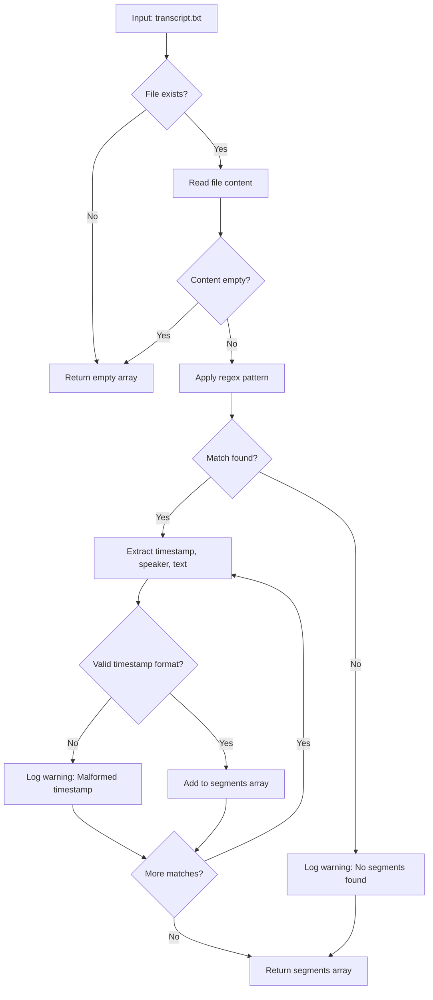

# 📦 Pre-Week 5 Prep Kit: Hooks, Guardrails & Observability

**Distributed:** End of Week 4  
**Due:** Before Week 5 class  
**Estimated Time:** 45 min total

---

## Overview

Week 5 shifts from "making it work" to "making it auditable." You'll learn how to see *inside* the AI's decision-making process and ensure your code stays aligned with your `constitution.md`.

| Item | Type | Time Est. |
|:-----|:-----|:----------|
| 1. Hooks & Guardrails Pre-reading | Read | 15 min |
| 2. `/review` + Mermaid Logic Trace Overview | Read | 15 min |
| 3. `ruff` Linter Preview | Read | 10 min |
| 4. Gate 5 Checklist Preview | Read | 5 min |

---

## Item 1: Hooks & Guardrails Pre-reading (15 min)

**Purpose:** Prepare for Group B's presentation on Hooks & Guardrails in Week 5.

- [Gemini Chat](https://gemini.google.com/share/33bd830589d0)
- [Deep Research Report](https://gemini.google.com/share/fe6457893bff)

---

## Item 2: `/review` + Mermaid Logic Trace Overview (15 min)

**Purpose:** Understand how `/review` provides observability into AI-generated code — including a visual logic trace.

### The Problem: The Black Box

When the AI generates code, it *works* (usually). But can you explain *why* it made specific decisions?

- Why did `parse_transcript.py` split at timestamp `[12:34]`?
- Why did it classify Speaker 2 as "Guest" instead of "Co-host"?
- Why did it skip the segment at `[45:00]`?

Without observability, the AI is a **black box**. Code that runs is not code you understand.

### The Solution: `/review` with Logic Trace

The `/review` command does two things:

| Check | What It Does |
|:------|:-------------|
| **Code Quality Audit** | Compares your code against `constitution.md` Tech Stack Rules + `ruff` linter output |
| **Logic Trace (Mermaid Diagram)** | Generates a visual flowchart showing the AI's decision-making path |

### Sample `/review` Output

When you run `/review` on `parse_transcript.py`, you'll see:

```
📋 /review Results: parse_transcript.py

## Code Quality Audit
✅ Python 3.11+ syntax — compliant with constitution.md
✅ Type hints present — compliant
⚠️ Missing docstring on helper function `_validate_timestamp()` — recommend adding
✅ ruff check passed (0 errors, 1 warning)

## Logic Trace

See diagram below for decision flow:
```

### Sample Mermaid Logic Trace



### Why This Matters

| Without Logic Trace | With Logic Trace |
|:--------------------|:-----------------|
| "The code skipped a segment" | "The code skipped segment at `[45:00]` because timestamp validation failed (regex didn't match `[45:00:00]` format)" |
| "It classified someone as Guest" | "Speaker 2 classified as 'Guest' because they spoke after the intro segment and weren't in the `hosts[]` array" |
| "I don't know why it crashed" | "Crash occurred at decision node J — input had unexpected `[MM:SS:MS]` format" |

### What You'll See in Week 5

In **Lesson 5.4**, the instructor will:

1. Run `/review` on the Podcast Skill demo code
2. Walk through the Mermaid diagram to explain the "Cutting Logic"
3. Show how to use the diagram to debug edge cases from your Black-Box Test Tables

**Your job:** Understand the *concept* now, so you can apply it to your capstone code in Week 5.

---

## Item 3: `ruff` Linter Preview (10 min)

**Purpose:** Understand what static analysis will check when you have code to review.

### What is `ruff`?

`ruff` is a fast Python linter that checks your code for:

- Syntax errors
- Style violations (PEP 8)
- Unused imports
- Undefined variables
- Common bugs

### Why We Use It

| Tool | What It Checks | When |
|:-----|:---------------|:-----|
| `ruff` | Technical correctness (syntax, style, bugs) | Before `/review` |
| `/review` | Spec alignment + Logic Trace | After `ruff` passes |

Think of `ruff` as the **spell-checker** and `/review` as the **editor**. You fix spelling first, then check if the story makes sense.

### How It Works

Once you have Python code in your `.skills/` folder, you'll run:

```bash
# Install ruff (if not already installed)
uv pip install ruff

# Run linter on your skills folder
ruff check .skills/
```

### Sample Output

```
.skills/podcast-marketing/scripts/parse_transcript.py:15:1: F401 `os` imported but unused
.skills/podcast-marketing/scripts/parse_transcript.py:42:5: E722 Do not use bare `except`
Found 2 errors.
```

### What to Do With Errors

| Error Code | Meaning | Fix |
|:-----------|:--------|:----|
| `F401` | Unused import | Remove the import line |
| `E722` | Bare `except:` | Specify exception type: `except ValueError:` |
| `E501` | Line too long | Break into multiple lines |
| `F841` | Variable assigned but never used | Remove or use the variable |

### When You'll Use This

In **Week 5**, after you've generated code with Copilot:

1. Run `ruff check .skills/` to catch technical issues
2. Fix any errors
3. Run `/review` to check spec alignment + generate Logic Trace
4. Iterate until both pass

**Note:** You don't have code yet — this is a preview. You'll run `ruff` for real in Week 5.

---

## Item 4: Gate 5 Checklist Preview (5 min)

**Purpose:** Know what's due by the end of Week 5 (Skill Gate).

### Gate 5 Criteria

| Criterion | Owner | Description |
|:----------|:------|:------------|
| Both skills pass `/review` | Skill Owners | Code quality audit + Logic Trace generated |
| PM integration in progress | PM | Cross-skill handoffs working or documented |
| `ruff` check passes | Skill Owners | 0 errors on `.skills/` folder |

### What This Means for Each Role

**Skill Owners (Skill A & Skill B):**

- Your scaffolded code from Week 4 must be **extended** with real logic
- You must run `ruff check` and fix all errors
- You must run `/review` and address any ⚠️ warnings
- Your Logic Trace (Mermaid diagram) should be committed to your repo

**PM / Integrator:**

- You must verify that Skill A's output can be consumed by Skill B
- Document any integration blockers in `DEBT.md`
- Begin drafting the integration layer (if applicable)

### Self-Check Before Week 5

| Question | Yes/No |
|:---------|:------:|
| Do I understand what "observability" means? | ☐ |
| Can I explain what a Logic Trace shows? | ☐ |
| Do I know what `ruff` checks for? | ☐ |
| Do I know my Gate 5 deliverables? | ☐ |

---

## Questions?

Bring any unresolved questions to the **Week 5 Stand-up (Lesson 5.1)** — that's the time to clarify before we dive into observability.

---

*End of Pre-Week 5 Prep Kit*
