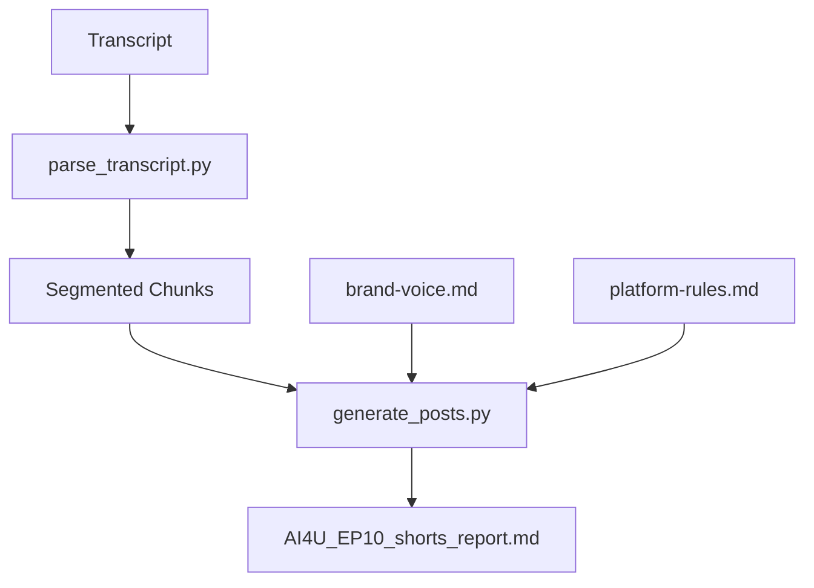
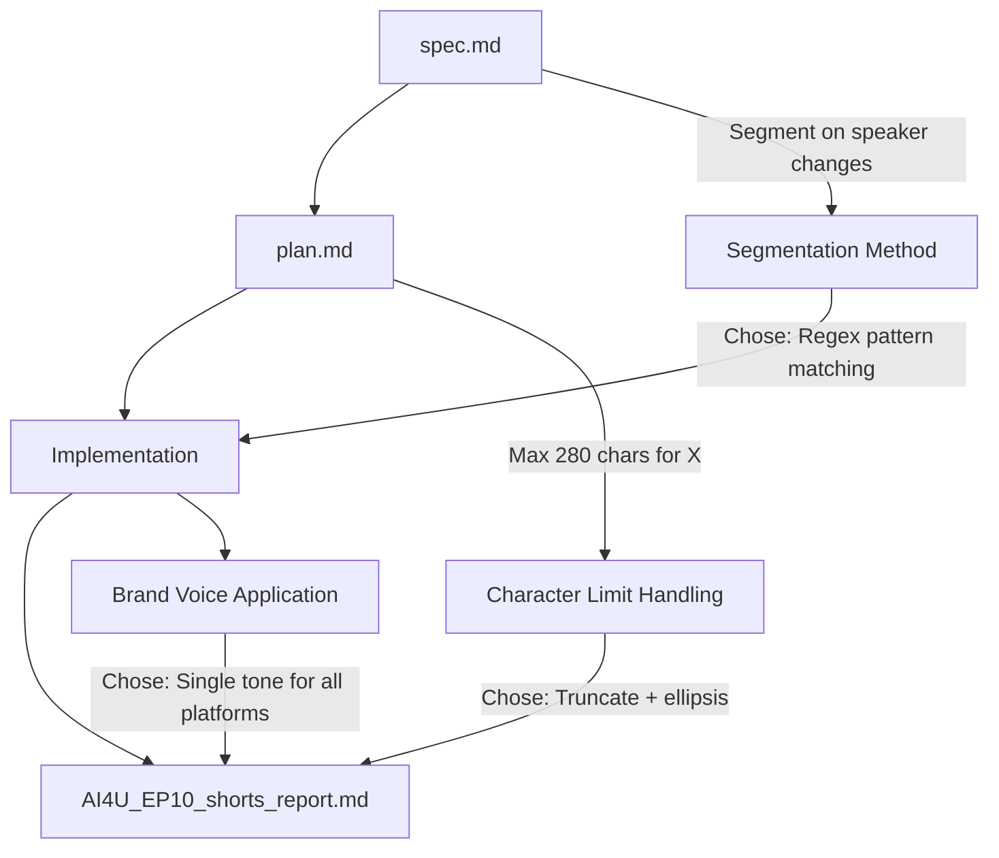

# 🎬 Lesson 6.4 Demo Kit: Full Observability Stack

**Duration:** 30 min  
**Format:** Instructor Live Demo  
**Metaphor:** 🔍 The Investigator  
**Goal:** Demonstrate the complete observability sequence (`/scout` → `/review` → `/trace`) on the integrated Podcast Skill

---

## Overview

| Phase | Time | Command | Metaphor | Teaching Moment |
|:------|:-----|:--------|:---------|:----------------|
| 1. Recap | 0:00–0:02 | — | — | "We have a working, integrated skill. Now we ensure it's transparent and compliant." |
| 2. `/scout` | 0:02–0:08 | `/scout` | 🗺️ The Cartographer | "Before we audit, we need a map." |
| 3. `/review` | 0:08–0:18 | `/review` | ⚖️ The Auditor | "The best way to manage an AI intern is with an AI supervisor." |
| 4. `/trace` | 0:18–0:28 | `/trace` | 🔍 The Investigator | "Now we reveal WHY decisions were made — and what could break." |
| 5. Wrap-up | 0:28–0:30 | — | — | "This is your pre-flight checklist before every demo." |

---

## Setup Checklist

### Files Required

| File | Location | Purpose |
|:-----|:---------|:--------|
| `constitution.md` | Project root | Constraints for `/review` |
| `spec.md` | Project root | Requirements for `/review` |
| `plan.md` | Project root | Implementation roadmap for `/review` |
| `AI4U_EP10_shorts_report.md` | Output folder | Project output for `/trace` |
| Podcast Skill folder | `.skills/podcast-marketing/` | Target for `/scout` |

### Screen Layout

| Panel | Content |
|:------|:--------|
| **Left** | VS Code with `.skills/podcast-marketing/` expanded |
| **Right** | Copilot Chat panel |
| **Bottom** | Terminal (optional — for git commands) |

### Pre-Demo Verification

- [ ] Podcast Skill is fully integrated (Weeks 4–5 work complete)
- [ ] `AI4U_EP10_shorts_report.md` exists and contains valid output
- [ ] Holy Trinity files (`constitution.md`, `spec.md`, `plan.md`) are committed
- [ ] `/scout`, `/review`, `/trace` commands are functional
- [ ] Screen sharing is ready

---

## Phase 1: Recap (0:00–0:02)

### Instructor Actions

1. Open VS Code with the Podcast Skill project
2. Show the `.skills/podcast-marketing/` folder structure briefly

### Narration

> "Over the past two weeks, we've built and integrated the Podcast Marketing Skill. It takes a transcript, segments it, and produces marketing content."
>
> "Today, we're going to run the **full observability stack** — three commands that answer three questions:
> 1. **What do we have?** (`/scout`)
> 2. **Does it comply?** (`/review`)
> 3. **Why did it make these decisions — and what could break?** (`/trace`)
>
> This is your pre-flight checklist before any demo."

### Transition Cue

> "Let's start by mapping what we've built."

---

## Phase 2: `/scout` (0:02–0:08)

### Instructor Actions

1. Open Copilot Chat
2. Run `/scout`
3. Wait for `ARCHITECTURE.md` to generate
4. Open and display `ARCHITECTURE.md`

### Command

```
/scout
```

### Expected Output: `ARCHITECTURE.md`

```markdown
# Architecture: podcast-marketing

## File Index

| File | Purpose |
|:-----|:--------|
| `SKILL.md` | Entry point — metadata, invocation instructions |
| `scripts/parse_transcript.py` | Segments transcript by speaker/topic |
| `scripts/generate_posts.py` | Transforms segments into platform-specific posts |
| `assets/brand-voice.md` | Brand guidelines for tone/style |
| `assets/platform-rules.md` | Character limits, hashtag rules per platform |

## Architecture Diagram



## Module Descriptions

### `parse_transcript.py`
- **Input:** Raw transcript (`.txt` or `.md`)
- **Output:** JSON array of segments with timestamps
- **Logic:** Splits on speaker changes; filters segments < 30s

### `generate_posts.py`
- **Input:** Segmented chunks (JSON)
- **Output:** Marketing kit (Markdown)
- **Logic:** Applies brand voice; enforces platform character limits
```

### Teaching Moments

| What You Show | What You Say |
|:--------------|:-------------|
| File Index table | "This is your inventory — every file and its purpose." |
| Mermaid diagram | "This is the data flow. Transcript in, marketing kit out. Notice how `brand-voice.md` and `platform-rules.md` feed into the generation step." |
| Module Descriptions | "Each script has clear inputs, outputs, and logic. If this isn't clear, your AI intern will drift." |

### Consulting Moment

> "In a real consulting engagement, you'd share this `ARCHITECTURE.md` with the client. It's a one-page summary of what you built — no code required."

### Transition Cue

> "Now we have a map. Let's audit it against our Holy Trinity."

---

## Phase 3: `/review` (0:08–0:18)

### Instructor Actions

1. Run `/review` in Copilot Chat
2. Wait for Review Report to generate
3. Walk through each section

### Command

```
/review
```

### Expected Output: Review Report

```markdown
## Review Report: podcast-marketing

**Generated:** 2026-03-08T14:32:00Z

---

### Consistency Check

| Artifact | Status | Findings |
|:---------|:------:|:---------|
| `constitution.md` | ✅ | Tech stack compliant (Python, no external APIs) |
| `spec.md` | ✅ | All functional requirements covered |
| `plan.md` | ⚠️ | Minor drift: Plan specified "NLP segmentation"; implementation uses regex |

### Coverage Summary

| Requirement (from spec.md) | Implemented | File |
|:---------------------------|:-----------:|:-----|
| Parse transcript into segments | ✅ | `parse_transcript.py` |
| Generate LinkedIn posts | ✅ | `generate_posts.py` |
| Generate X (Twitter) threads | ✅ | `generate_posts.py` |
| Apply brand voice | ✅ | `generate_posts.py` + `brand-voice.md` |
| Enforce character limits | ✅ | `generate_posts.py` + `platform-rules.md` |

### Flagged Issues

| Severity | Issue | Location | Recommendation |
|:--------:|:------|:---------|:---------------|
| ⚠️ | Plan drift: Regex used instead of NLP | `parse_transcript.py` | Update `plan.md` to reflect actual implementation, or refactor to use NLP |
```

### Teaching Moments

| What You Show | What You Say |
|:--------------|:-------------|
| Consistency Check table | "Green checks mean we're compliant. The warning on `plan.md` tells us we drifted — we said we'd use NLP, but we used regex." |
| Coverage Summary | "This is your spec coverage matrix. Every requirement from `spec.md` should have a checkmark. If not, you have a gap." |
| Flagged Issues | "This is your action list. The AI supervisor caught something — now you decide: update the plan, or refactor the code." |

### What If Live Demo Is "Too Clean"?

If `/review` returns all green with no warnings:

> "Great news — we're fully compliant. But let me show you what a warning would look like..."

Then describe a hypothetical:

> "If we had used `requests` instead of the approved `httpx` library, `/review` would flag: 'Constitution violation: Unapproved dependency.' That's the AI supervisor catching the intern's mistake."

### Consulting Moment

> "In consulting, this Review Report is your audit trail. When the client asks 'Did you follow the spec?', you show them this. It's not your word — it's the AI's verification."

### Transition Cue

> "We know WHAT we built and WHETHER it complies. Now let's understand WHY it made the decisions it did — and what could break."

---

## Phase 4: `/trace` (0:18–0:28)

### Instructor Actions

1. Run `/trace` in Copilot Chat
2. Wait for Trace Report to generate
3. Walk through all three sections: Decision Path, Assumption Challenges, Landmines

### Command

```
/trace
```

### Inputs Consumed

| Input | Source |
|:------|:-------|
| `ARCHITECTURE.md` | Output from `/scout` (Phase 2) |
| Review Report | Output from `/review` (Phase 3) |
| `AI4U_EP10_shorts_report.md` | Actual project output |

### Expected Output: Trace Report

```markdown
## Trace Report: podcast-marketing

**Generated:** 2026-03-08T14:35:00Z  
**Inputs:**
- Architecture: `ARCHITECTURE.md`
- Review Report: `REVIEW_REPORT.md`
- Project Output: `AI4U_EP10_shorts_report.md`

---

### 1. Decision Path



### Decision Summary

| # | Decision | Source | Chose | Over |
|:--|:---------|:-------|:------|:-----|
| 0 | Segmentation Method | spec.md | Regex pattern matching | NLP sentence boundary detection |
| 1 | Character Limit Handling | plan.md | Truncate + ellipsis | LLM summarization |
| 2 | Brand Voice Application | implementation | Single tone for all platforms | Platform-specific tones |

---

### 2. Assumption Challenges

| Decision Point | Assumption Made | Challenge Question | Risk |
|:---------------|:----------------|:-------------------|:-----|
| Segmentation Method | Transcript has clear speaker labels | What if transcript lacks speaker labels (auto-transcription without diarization)? | 🟡 Medium |
| Character Limit Handling | Truncation preserves meaning | Does cutting mid-sentence lose critical context? | 🟡 Medium |
| Brand Voice Application | Single tone fits all platforms | Should LinkedIn (professional) vs. X (casual) have different tones? | 🔵 Low |

### Action Items

- [ ] **MEDIUM PRIORITY:** Address "Segmentation Method" — Add fallback for transcripts without speaker labels
- [ ] **MEDIUM PRIORITY:** Address "Character Limit Handling" — Consider smart truncation at sentence boundaries

---

### 3. Landmines

| Landmine | Trigger Condition | Impact | Mitigation | Risk |
|:---------|:------------------|:-------|:-----------|:-----|
| 🔴 No Speaker Labels | Transcript from auto-transcription (no diarization) | Segmentation fails silently; outputs garbage | Add fallback: segment on pauses > 3s or topic shifts |
| 🟡 API Rate Limit | > 10 LLM calls in 60s | Process hangs or fails | Add retry logic with exponential backoff |
| 🔴 Context Overflow | Transcript > 50k tokens | AI truncates without warning; loses ending | Chunk transcript before processing |
| 🟡 Platform Rule Changes | X changes character limit (280 → 500) | Posts under-utilize space | Externalize limits to `platform-rules.md` (already done ✅) |

### Pre-Demo Checklist

- [ ] **No Speaker Labels:** Test with auto-transcribed input; verify fallback works
- [ ] **Context Overflow:** Test with 60-min transcript; verify chunking works
- [ ] **API Rate Limit:** Verify retry logic is implemented

---

*End of Trace Report*
```

### Teaching Moments — Decision Path (0:18–0:22)

| What You Show | What You Say |
|:--------------|:-------------|
| Mermaid diagram | "This is the decision tree. Every arrow is a choice. Spec said 'segment on speaker changes' — we chose regex over NLP. That's Decision 0." |
| Decision Summary table | "Three key decisions. For each one, we can trace back to WHERE it came from (spec, plan, or implementation) and WHAT we chose over alternatives." |

### Teaching Moments — Assumption Challenges (0:22–0:25)

| What You Show | What You Say |
|:--------------|:-------------|
| Assumption Challenges table | "These are the silent choices — things we assumed but never explicitly stated. The AI is now challenging us: 'What if your assumption is wrong?'" |
| Challenge Questions | "Look at Decision 0: We assumed the transcript has speaker labels. But what if it's auto-transcribed from YouTube? No labels. Our regex fails silently." |
| Action Items | "These aren't bugs — they're risks. You decide whether to address them before demo day." |

### Teaching Moments — Landmines (0:25–0:28)

| What You Show | What You Say |
|:--------------|:-------------|
| Landmines table | "These are the things that could blow up during your demo. Red means high risk — address before presenting." |
| Pre-Demo Checklist | "This is your pre-flight checklist. Run `/trace` before every demo. If you see red, fix it or have a backup plan." |
| "No Speaker Labels" landmine | "This one is real. If your client gives you a YouTube auto-transcript, your skill breaks. The mitigation: add a fallback that segments on pauses instead." |

### Consulting Moment

> "In consulting, `/trace` is your risk register. Before you demo to a client, you run this. If there's a red landmine, you either fix it or you prepare a talking point: 'We're aware of this edge case and here's our mitigation plan.'"

### Transition Cue

> "That's the full observability stack. Let's recap."

---

## Phase 5: Wrap-up (0:28–0:30)

### Instructor Actions

1. Return to VS Code
2. Show the three output files: `ARCHITECTURE.md`, Review Report, Trace Report

### Narration

> "You now have three artifacts:
> 
> 1. **`ARCHITECTURE.md`** — What you built (the map)
> 2. **Review Report** — Whether it complies (the audit)
> 3. **Trace Report** — Why it made decisions and what could break (the investigation)
>
> This is your pre-flight checklist. Before every demo, run:
> ```
> /scout → /review → /trace
> ```
>
> If `/review` shows red, you have compliance issues.
> If `/trace` shows red landmines, you have demo risks.
>
> Fix them, or prepare your talking points."

### Capstone Connection

> "In your Final Sprint (Lesson 6.5), you'll run this exact sequence on your integrated capstone project. Your PM will own the Trace Report and present the landmines at Gate 6."

### Transition to Lesson 6.5

> "Now it's your turn. You have 59 minutes to finalize integration and run the full observability stack. Let's go."

---

## Instructor Notes

### If `/scout` Takes Too Long

- Have a pre-generated `ARCHITECTURE.md` ready as backup
- Say: "In the interest of time, let me show you what `/scout` produces..."

### If `/review` Returns All Green

- This is fine — celebrate it
- Describe a hypothetical violation to illustrate the teaching point
- Example: "If we had used an unapproved library, `/review` would flag it here."

### If `/trace` Output Is Overwhelming

- Focus on ONE landmine (recommend: "No Speaker Labels")
- Walk through the full row: Trigger → Impact → Mitigation
- Say: "The other landmines follow the same pattern. Review them after class."

### Capstone Alignment

| Capstone Project | Likely Landmines |
|:-----------------|:-----------------|
| **Data Prep Pipeline** | Missing values not handled; schema drift; large file timeout |
| **Code Generation** | Difficulty mismatch; syntax errors in generated code; prompt injection |
| **Auto Documentation** | Inconsistent docstring format; missing functions; context overflow |

Mention these briefly:

> "Your capstone will have different landmines. Data Prep teams — watch for missing value handling. Code Gen teams — watch for difficulty mismatch. Doc teams — watch for context overflow."

---

## Quick Reference: Output Anatomy

### `/scout` Output: `ARCHITECTURE.md`

| Section | Content |
|:--------|:--------|
| File Index | Table of all files + purposes |
| Architecture Diagram | Mermaid flowchart of data flow |
| Module Descriptions | Input/output/logic per script |

### `/review` Output: Review Report

| Section | Content |
|:--------|:--------|
| Consistency Check | Holy Trinity compliance (✅/⚠️/❌) |
| Coverage Summary | Spec requirements → implementation mapping |
| Flagged Issues | Action items with severity |

### `/trace` Output: Trace Report

| Section | Content |
|:--------|:--------|
| Decision Path | Mermaid diagram + decision summary table |
| Assumption Challenges | Implicit choices + challenge questions |
| Landmines | Risks + triggers + mitigations + pre-demo checklist |

---

## Appendix: Command Sequence Summary

```
┌─────────────────────────────────────────────────────────────┐
│                  FULL OBSERVABILITY STACK                   │
├─────────────────────────────────────────────────────────────┤
│                                                             │
│   /scout ──────► ARCHITECTURE.md                            │
│      │              (The Map)                               │
│      ▼                                                      │
│   /review ─────► Review Report                              │
│      │              (The Audit)                             │
│      ▼                                                      │
│   /trace ──────► Trace Report                               │
│                     (The Investigation)                     │
│                                                             │
│   Inputs to /trace:                                         │
│   • ARCHITECTURE.md (from /scout)                           │
│   • Review Report (from /review)                            │
│   • Project Output (e.g., AI4U_EP10_shorts_report.md)       │
│                                                             │
└─────────────────────────────────────────────────────────────┘
```

---

*End of Lesson 6.4 Demo Kit*
