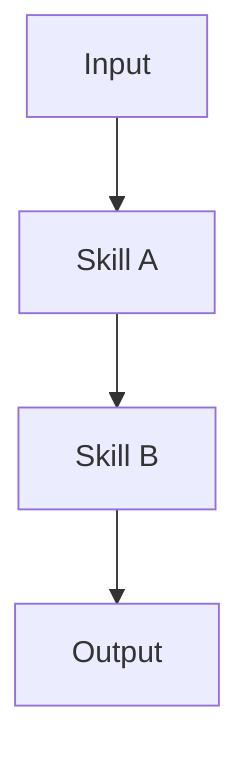

# 📋 Week 7: Dress Rehearsal & Pre-Flight Check — Comprehensive Guide

**Duration:** 3 Hours (180 min)  
**Theme:** Full end-to-end run-through, peer feedback, and final polish  
**Goal:** Ensure every team has a functional Happy Path, timed presentation, and client-ready documentation

---

## Overview

### What "Ready for Week 8" Means

| Criterion | Description |
|:----------|:------------|
| **Happy Path Works** | Core functionality runs end-to-end without errors |
| **Demo Rehearsed** | Full 25-min run-through completed with timing verified |
| **Documentation Complete** | README.md finalized; HANDOFF.md client-ready |
| **Landmines Resolved** | All 🔴 High-risk items fixed or mitigated |
| **Peer Feedback Addressed** | Critical feedback from 7.4 incorporated |

### Client Delivery Timeline

| Day | Milestone |
|:----|:----------|
| **Week 7 (Class)** | `HANDOFF.md` Client-Ready Audit passed |
| **Week 8 (Class)** | Final Showcase; PM presents `HANDOFF.md` highlights |
| **Week 8 + 1 Day** | `HANDOFF.md` shared with clients |

---

## Session Schedule

| Time | Lesson | Duration | Type | Topic |
|:-----|:-------|:---------|:-----|:------|
| 00:00 – 00:15 | **7.1** | 15 min | Stand-up | **Pre-Flight Check** — Feature freeze confirmation; demo readiness |
| 00:15 – 00:30 | **7.2** | 15 min | Lecture | **Demo Day Expectations** — Format, timing, Q&A handling, rubric review |
| 00:30 – 01:45 | **7.3** | 75 min | Rehearsal | **Team Dress Rehearsals** — 25 min per team (5 + 10 + 10) |
| 01:45 – 02:15 | **7.4** | 30 min | Feedback | **Structured Peer Feedback Session** |
| 02:15 – 02:50 | **7.5** | 35 min | Hands-on | **Final Polish Sprint** — Address critical feedback; fix blockers |
| 02:50 – 03:00 | **7.6** | 10 min | Gate | **Pre-Flight Gate & Client-Ready Audit** |

---

## Lesson 7.1: Pre-Flight Check (15 min)

### Goal

Confirm feature freeze; assess demo readiness across all teams.

### Feature Freeze Declaration

> **Feature Freeze is NOW in effect.**
> 
> From this point forward:
> - ❌ No new features
> - ✅ Bug fixes only
> - ✅ Documentation improvements
> - ✅ Demo polish

### Demo Readiness Self-Assessment

Each team completes this checklist before proceeding:

| Check | Status | Notes |
|:------|:------:|:------|
| **Happy Path:** Core functionality works end-to-end | ☐ | |
| **Integration:** Skill A → Skill B data flow verified | ☐ | |
| **`/review` Audit:** No ❌ critical errors | ☐ | |
| **`/trace` Run:** Landmines documented or resolved | ☐ | |
| **README.md:** Draft complete | ☐ | |
| **HANDOFF.md:** Draft started | ☐ | |
| **Sample Input:** Ready for demo | ☐ | |

### Stand-up Format (per team, 3 min each)

| Question | Answer |
|:---------|:-------|
| **Status:** Where are you? | [Green / Yellow / Red] |
| **Blocker:** What's stopping you? | [Blocker or "None"] |
| **Focus:** What will you accomplish today? | [Top priority] |

---

## Lesson 7.2: Demo Day Expectations (15 min)

### Demo Format: 5 + 10 + 10

| Segment | Duration | Focus | Who |
|:--------|:---------|:------|:----|
| **Presentation** | 5 min | Problem, solution, value proposition | PM leads |
| **Demo** | 10 min | Happy Path walkthrough | Skill Owners lead |
| **Q&A** | 10 min | Audience questions | Full team |

**Total:** 25 min per team

### Timing Tips

| Segment | Pitfall | Mitigation |
|:--------|:--------|:-----------|
| **Presentation** | Running over 5 min | Practice with timer; cut slides if needed |
| **Demo** | Technical failure mid-demo | Have backup (pre-recorded or screenshots) |
| **Demo** | Explaining too much code | Focus on WHAT it does, not HOW |
| **Q&A** | Rambling answers | Use "Answer + Example + Stop" pattern |

### Q&A Handling Strategies

| Scenario | Strategy |
|:---------|:---------|
| **You know the answer** | Answer concisely → Give one example → Stop |
| **You don't know** | "That's a great question. I don't have the answer right now, but I'll follow up after class." |
| **Question is out of scope** | "That's outside our current scope, but it's noted for future iterations." |
| **Question challenges your approach** | "That's valid feedback. Here's why we chose this approach: [reason]. We've documented the trade-off in our DEBT.md." |

### Rubric Preview

Teams will be evaluated on:

| Category | Weight | What Evaluators Look For |
|:---------|:------:|:-------------------------|
| **Presentation** | 20% | Clear problem statement; value articulated; professional delivery |
| **Demo** | 40% | Happy Path works; smooth execution; error recovery |
| **Q&A** | 20% | Clear answers; handles unknowns professionally; demonstrates depth |
| **Documentation** | 20% | README complete; HANDOFF.md client-ready; artifacts committed |

---

## Lesson 7.3: Team Dress Rehearsals (75 min)

### Schedule (3 Teams)

| Time | Team | Activity |
|:-----|:-----|:---------|
| 00:30 – 00:55 | Team 1 | Dress Rehearsal (5 + 10 + 10) |
| 00:55 – 01:20 | Team 2 | Dress Rehearsal (5 + 10 + 10) |
| 01:20 – 01:45 | Team 3 | Dress Rehearsal (5 + 10 + 10) |

### Rehearsal Structure

```
┌─────────────────────────────────────────────────────────────┐
│                    25-MIN DRESS REHEARSAL                   │
├─────────────────────────────────────────────────────────────┤
│                                                             │
│   [0:00 – 0:05]  PRESENTATION (5 min)                       │
│   ├── Problem Statement (1 min)                             │
│   ├── Solution Overview (2 min)                             │
│   └── Value Proposition + Team Intro (2 min)                │
│                                                             │
│   [0:05 – 0:15]  DEMO (10 min)                              │
│   ├── Setup Context (1 min)                                 │
│   ├── Happy Path Walkthrough (7 min)                        │
│   └── Output Review (2 min)                                 │
│                                                             │
│   [0:15 – 0:25]  Q&A (10 min)                               │
│   └── Audience questions; instructor probes                 │
│                                                             │
└─────────────────────────────────────────────────────────────┘
```

### While Not Presenting

Teams not presenting should:

1. **Observe** — Take notes on what works well
2. **Prepare Questions** — Think of 1–2 questions for Q&A
3. **Fill Out Feedback Form** — Use the Peer Feedback Rubric (Lesson 7.4)

---

## Lesson 7.4: Structured Peer Feedback Session (30 min)

### Goal

Teams provide constructive feedback using a structured rubric.

### Peer Feedback Rubric

Each team evaluates the other teams using this rubric:

#### Presentation (5 min) — 20 points

| Criterion | 1 (Needs Work) | 2 (Developing) | 3 (Proficient) | 4 (Excellent) | Score |
|:----------|:---------------|:---------------|:---------------|:--------------|:-----:|
| **Problem Statement** | Unclear or missing | Vague; hard to follow | Clear but generic | Compelling and specific | /4 |
| **Solution Overview** | Confusing; too technical | Understandable but incomplete | Clear explanation | Clear + demonstrates insight | /4 |
| **Value Proposition** | Not articulated | Mentioned but weak | Clear value stated | Quantified or compelling proof | /4 |
| **Team Introduction** | Missing or awkward | Basic intro | Professional intro | Engaging; roles clear | /4 |
| **Timing** | Significantly over/under | Slightly off | On time | Perfect pacing | /4 |

**Presentation Subtotal:** /20

#### Demo (10 min) — 40 points

| Criterion | 1 (Needs Work) | 2 (Developing) | 3 (Proficient) | 4 (Excellent) | Score |
|:----------|:---------------|:---------------|:---------------|:--------------|:-----:|
| **Happy Path Execution** | Fails to complete | Completes with major issues | Completes with minor issues | Flawless execution | /8 |
| **Narration** | Silent or confusing | Inconsistent explanation | Clear narration | Engaging storytelling | /8 |
| **Error Handling** | Panics; no recovery | Recovers awkwardly | Recovers professionally | Anticipates and prevents | /8 |
| **Output Quality** | Output missing or broken | Output present but unclear | Output clear and correct | Output impressive; exceeds spec | /8 |
| **Timing** | Significantly over/under | Slightly off | On time | Perfect pacing | /8 |

**Demo Subtotal:** /40

#### Q&A (10 min) — 20 points

| Criterion | 1 (Needs Work) | 2 (Developing) | 3 (Proficient) | 4 (Excellent) | Score |
|:----------|:---------------|:---------------|:---------------|:--------------|:-----:|
| **Answer Clarity** | Confusing or wrong | Partially correct | Clear and correct | Insightful; adds value | /5 |
| **Handling Unknowns** | Guesses or deflects | Admits but no follow-up plan | Admits + promises follow-up | Admits + offers related insight | /5 |
| **Team Coordination** | One person dominates | Uneven participation | Balanced participation | Seamless handoffs | /5 |
| **Depth of Knowledge** | Surface-level only | Some depth shown | Good technical depth | Expert-level understanding | /5 |

**Q&A Subtotal:** /20

#### Documentation — 20 points

| Criterion | 1 (Needs Work) | 2 (Developing) | 3 (Proficient) | 4 (Excellent) | Score |
|:----------|:---------------|:---------------|:---------------|:--------------|:-----:|
| **README.md** | Missing or incomplete | Draft with gaps | Complete draft | Polished; client-ready | /5 |
| **HANDOFF.md** | Missing | Started but incomplete | Complete draft | Client-ready; professional | /5 |
| **SDD Artifacts** | Missing artifacts | Some artifacts committed | All artifacts committed | All artifacts + well-organized | /5 |
| **Code Quality** | `/review` fails | `/review` warnings | `/review` passes | `/review` passes + clean code | /5 |

**Documentation Subtotal:** /20

---

#### Total Score: /100

| Score Range | Rating |
|:------------|:-------|
| 90–100 | 🟢 Excellent — Ready for Demo Day |
| 75–89 | 🟡 Proficient — Minor polish needed |
| 60–74 | 🟠 Developing — Significant work needed |
| Below 60 | 🔴 Needs Work — Major gaps to address |

---

### Feedback Session Format (30 min)

| Time | Activity |
|:-----|:---------|
| 0:00 – 0:10 | Teams complete rubrics silently |
| 0:10 – 0:20 | Round-robin: Each team shares TOP 2 strengths + TOP 2 improvements for each other team |
| 0:20 – 0:30 | Teams discuss feedback internally; identify priorities for Final Polish Sprint |

### Giving Constructive Feedback

| Do | Don't |
|:---|:------|
| "The demo flow was smooth, but the transition at 0:07 felt rushed" | "The demo was bad" |
| "Consider adding a one-liner about why this matters to the client" | "You didn't explain anything" |
| "The Q&A answer about edge cases showed great depth" | "You were fine" |

### Receiving Feedback

| Do | Don't |
|:---|:------|
| Listen fully before responding | Interrupt or defend |
| Take notes | Dismiss feedback |
| Ask clarifying questions | Argue |
| Thank the reviewer | Take it personally |

---

## Lesson 7.5: Final Polish Sprint (35 min)

### Goal

Address critical feedback from peer review; fix remaining blockers; finalize documentation.

### Prioritization Framework

```
┌─────────────────────────────────────────────────────────────┐
│                  FINAL POLISH PRIORITIZATION                │
├─────────────────────────────────────────────────────────────┤
│                                                             │
│   PRIORITY 1: Demo Blockers (Must Fix)                      │
│   └── Anything that prevents Happy Path from running        │
│                                                             │
│   PRIORITY 2: Critical Feedback (Should Fix)                │
│   └── Top 2 improvements from peer feedback                 │
│                                                             │
│   PRIORITY 3: Documentation Gaps (Should Complete)          │
│   └── README.md finalization; HANDOFF.md client-ready       │
│                                                             │
│   PRIORITY 4: Nice-to-Haves (If Time Permits)               │
│   └── Minor polish; additional examples                     │
│                                                             │
└─────────────────────────────────────────────────────────────┘
```

### Sprint Workflow (35 min)

| Time | Activity | Owner |
|:-----|:---------|:------|
| 0:00 – 0:05 | Triage: Identify top 3 priorities from feedback | PM |
| 0:05 – 0:25 | Execute: Fix blockers; address critical feedback | Team |
| 0:25 – 0:30 | Documentation: Finalize README.md; complete HANDOFF.md | PM + Team |
| 0:30 – 0:35 | Commit: Push all changes; verify Gate 7 criteria | PM |

### Documentation Checklist

| Document | Status | Client-Ready? |
|:---------|:------:|:-------------:|
| **README.md** | ☐ Complete | ☐ |
| **HANDOFF.md** | ☐ Complete | ☐ |
| **spec.md** | ☐ Committed | — |
| **constitution.md** | ☐ Committed | — |
| **plan.md** | ☐ Committed | — |
| **interface-spec.md** | ☐ Committed | — |
| **tasks.md** | ☐ Committed | — |
| **ARCHITECTURE.md** | ☐ Committed | — |
| **DEBT.md** | ☐ Updated | — |

---

## Lesson 7.6: Pre-Flight Gate & Client-Ready Audit (10 min)

### Gate 7 Criteria (Pre-Flight Gate)

| Criterion | Owner | Status |
|:----------|:------|:------:|
| **Feature Freeze:** No new features after Week 7 | Team | ☐ |
| **Peer Feedback:** Addressed critical feedback from 7.4 | Team | ☐ |
| **README.md:** Finalized | Team | ☐ |
| **HANDOFF.md:** Client-Ready Audit passed | PM | ☐ |
| **Demo Rehearsed:** Full 25-min run-through completed | Team | ☐ |
| **Landmines:** All 🔴 High-risk resolved or mitigated | Skill Owners | ☐ |

### Client-Ready Audit for `HANDOFF.md`

Before passing Gate 7, PM must verify `HANDOFF.md` passes this audit:

| Check | Criteria | Status |
|:------|:---------|:------:|
| **Professional Tone** | No internal jargon; no "TODO" placeholders; formal language | ☐ |
| **Completeness** | All sections filled; no empty fields | ☐ |
| **Accuracy** | Technical instructions tested; contact info verified | ☐ |
| **Formatting** | Consistent headers; clean markdown; no broken links | ☐ |
| **Tested by Non-Author** | Someone other than the author ran the setup instructions | ☐ |

### PM Sign-Off Template

```markdown
## Gate 7 Sign-Off: [Team Name]

**Date:** [Date]  
**PM:** [Name]

### Criteria Verification

| Criterion | Status | Notes |
|:----------|:------:|:------|
| Feature Freeze | ✅ / ❌ | |
| Peer Feedback Addressed | ✅ / ❌ | |
| README.md Finalized | ✅ / ❌ | |
| HANDOFF.md Client-Ready | ✅ / ❌ | |
| Demo Rehearsed | ✅ / ❌ | |
| Landmines Resolved | ✅ / ❌ | |

### Client-Ready Audit

| Check | Status |
|:------|:------:|
| Professional Tone | ✅ / ❌ |
| Completeness | ✅ / ❌ |
| Accuracy | ✅ / ❌ |
| Formatting | ✅ / ❌ |
| Tested by Non-Author | ✅ / ❌ |

### Outstanding Items for Week 8

1. [Item 1]
2. [Item 2]

### Sign-Off

- [ ] I confirm this team is ready for Week 8 Final Showcase.

**PM Signature:** _______________  
**Date:** _______________
```

---

## Appendix A: Presentation Template (5 min)

### Option 1: Strict Template (Default)

Use this structure for a guaranteed professional presentation.

```
┌─────────────────────────────────────────────────────────────┐
│                    5-MIN PRESENTATION                       │
├─────────────────────────────────────────────────────────────┤
│                                                             │
│   [0:00 – 0:01]  HOOK (1 min)                               │
│   "Imagine you're a [persona] and you need to [task]..."    │
│                                                             │
│   [0:01 – 0:02]  PROBLEM (1 min)                            │
│   "The challenge is [specific pain point]."                 │
│   "Currently, this takes [time/effort/cost]."               │
│                                                             │
│   [0:02 – 0:04]  SOLUTION (2 min)                           │
│   "Our project solves this by [high-level approach]."       │
│   "It works in three steps: [Step 1], [Step 2], [Step 3]."  │
│   [Show architecture diagram if helpful]                    │
│                                                             │
│   [0:04 – 0:05]  VALUE + TEAM (1 min)                       │
│   "This saves [time/money/effort] by [specific benefit]."   │
│   "Our team: [Name] (PM), [Name] (Skill A), [Name] (Skill B)│
│   "Now let's see it in action."                             │
│                                                             │
└─────────────────────────────────────────────────────────────┘
```

### Option 2: Flexible Outline (Alternative)

Use this if your project needs a different narrative flow.

| Section | Duration | Key Points |
|:--------|:---------|:-----------|
| **Opening** | 30 sec | Hook the audience; state the problem |
| **Context** | 1 min | Who has this problem? Why does it matter? |
| **Solution** | 2 min | What does your project do? How does it work? |
| **Value** | 1 min | What's the benefit? What's the impact? |
| **Transition** | 30 sec | Introduce team; transition to demo |

### Presentation Dos and Don'ts

| Do | Don't |
|:---|:------|
| Start with a story or scenario | Start with "Our project is called..." |
| Use simple language | Use jargon or acronyms |
| Show one visual (architecture diagram) | Show walls of text |
| State a specific benefit | Say "it's faster" without quantifying |
| End with a clear transition to demo | End abruptly |

---

## Appendix B: Demo Script Template (10 min)

### Option 1: Strict Template (Default)

```
┌─────────────────────────────────────────────────────────────┐
│                      10-MIN DEMO                            │
├─────────────────────────────────────────────────────────────┤
│                                                             │
│   [0:00 – 0:01]  SETUP (1 min)                              │
│   "Let me show you the Happy Path."                         │
│   "I'm starting with [sample input]."                       │
│   [Show input file briefly]                                 │
│                                                             │
│   [0:01 – 0:04]  SKILL A (3 min)                            │
│   "First, Skill A [does X]."                                │
│   [Run Skill A]                                             │
│   "As you can see, it produces [output]."                   │
│   [Show Skill A output]                                     │
│                                                             │
│   [0:04 – 0:07]  SKILL B (3 min)                            │
│   "Now Skill B takes that output and [does Y]."             │
│   [Run Skill B]                                             │
│   "Here's the final result."                                │
│   [Show Skill B output]                                     │
│                                                             │
│   [0:07 – 0:09]  OUTPUT REVIEW (2 min)                      │
│   "Let's look at the output in detail."                     │
│   [Walk through key sections of output]                     │
│   "Notice how it [meets spec requirement]."                 │
│                                                             │
│   [0:09 – 0:10]  WRAP-UP (1 min)                            │
│   "That's the Happy Path — from [input] to [output]."       │
│   "We're now ready for your questions."                     │
│                                                             │
└─────────────────────────────────────────────────────────────┘
```

### Option 2: Flexible Outline (Alternative)

| Section | Duration | Key Points |
|:--------|:---------|:-----------|
| **Context** | 1 min | Show input; explain what we're about to do |
| **Execution** | 6 min | Run the pipeline; narrate each step |
| **Output** | 2 min | Show final output; highlight key features |
| **Wrap-up** | 1 min | Summarize; transition to Q&A |

### Demo Dos and Don'ts

| Do | Don't |
|:---|:------|
| Narrate what's happening | Run in silence |
| Focus on WHAT it does | Explain every line of code |
| Have a backup plan | Assume it will work perfectly |
| Pause on key outputs | Rush through results |
| Acknowledge errors gracefully | Panic or apologize excessively |

### Error Recovery Script

If something breaks during the demo:

| Scenario | Script |
|:---------|:-------|
| **Minor glitch** | "Let me try that again." [Retry] |
| **Command fails** | "Interesting — this is a known edge case. Let me show you the expected output." [Show backup] |
| **Total failure** | "We're experiencing a technical issue. Let me walk you through what you would see." [Use screenshots/pre-recorded] |

---

## Appendix C: Q&A Prep Guide

### Common Questions by Category

#### Technical Questions

| Question | Suggested Answer Pattern |
|:---------|:-------------------------|
| "How does [component] work?" | "It [simple explanation]. For example, [concrete example]." |
| "Why did you choose [technology]?" | "We chose [tech] because [reason]. The alternative was [other option], but [trade-off]." |
| "What happens if [edge case]?" | "Currently, [behavior]. We've documented this in DEBT.md with a mitigation plan for [future fix]." |
| "How does it scale?" | "For our demo scope, it handles [X]. For production, we'd need to [scaling strategy]." |

#### Process Questions

| Question | Suggested Answer Pattern |
|:---------|:-------------------------|
| "How did you divide the work?" | "[PM] handled [X], [Skill Owner A] built [Y], [Skill Owner B] built [Z]. We integrated in Week 6." |
| "What was the hardest part?" | "The biggest challenge was [specific challenge]. We solved it by [approach]." |
| "What would you do differently?" | "If we started over, we'd [specific improvement]. We've noted this in our HANDOFF.md." |

#### Business Questions

| Question | Suggested Answer Pattern |
|:---------|:-------------------------|
| "Who would use this?" | "The primary user is [persona]. They would use it to [task]." |
| "What's the ROI?" | "This saves approximately [time/cost] per [unit]. For a typical user, that's [impact]." |
| "What's next for this project?" | "The immediate next step is [priority]. Long-term, we envision [roadmap]." |

### Handling "I Don't Know"

**Pattern:** Acknowledge → Offer Related Insight → Promise Follow-up

| Scenario | Response |
|:---------|:---------|
| **Technical unknown** | "I don't have the exact answer, but I know it relates to [related concept]. I'll follow up with specifics after class." |
| **Out of scope** | "That's outside our current scope. We focused on [scope]. It's a great idea for future iterations." |
| **Genuinely stumped** | "That's a great question. I don't know the answer right now, but I'll research it and follow up." |

### Q&A Team Coordination

| Role | Responsibility |
|:-----|:---------------|
| **PM** | Field business/process questions; redirect technical questions to Skill Owners |
| **Skill Owner A** | Answer questions about Skill A; support Skill Owner B if needed |
| **Skill Owner B** | Answer questions about Skill B; support Skill Owner A if needed |

**Handoff Script:**

> "That's a great question about [topic]. [Name], do you want to take that one?"

---

## Appendix D: `HANDOFF.md` Template — Client-Ready

This template is designed to be shared with clients **one day after Week 8**.

```markdown
# HANDOFF.md: [Project Name]

**Version:** 1.0  
**Date:** [Date]  
**Team:** [Team Name]

---

## 1. Project Overview

### What It Does

[2-3 sentences describing what the project does in plain language. No jargon.]

### Who It's For

[Primary user persona and their use case.]

### Key Value

[One sentence on the primary benefit. Quantify if possible.]

---

## 2. Technical Handoff

### Prerequisites

| Requirement | Version | Notes |
|:------------|:--------|:------|
| Python | 3.10+ | |
| [Dependency] | [Version] | |
| [Dependency] | [Version] | |

### Installation

```bash
# Clone the repository
git clone [repo-url]
cd [project-name]

# Create virtual environment
python -m venv venv
source venv/bin/activate  # On Windows: venv\Scripts\activate

# Install dependencies
pip install -r requirements.txt
```

### Environment Setup

```bash
# Copy environment template
cp .env.example .env

# Edit .env with your credentials
# Required variables:
# - [VAR_1]: [Description]
# - [VAR_2]: [Description]
```

### Running the Project

```bash
# Basic usage
python main.py --input [input-file]

# Example
python main.py --input samples/sample_transcript.txt
```

### Expected Output

| Input | Output | Location |
|:------|:-------|:---------|
| [Input type] | [Output type] | `output/[filename]` |

### Known Issues

| Issue | Severity | Workaround | Status |
|:------|:---------|:-----------|:-------|
| [Issue 1] | 🟡 Medium | [Workaround] | Documented |
| [Issue 2] | 🔵 Low | [Workaround] | Documented |

---

## 3. Architecture Summary

### System Diagram



### Key Components

| Component | Purpose | Location |
|:----------|:--------|:---------|
| Skill A | [Purpose] | `.skills/skill-a/` |
| Skill B | [Purpose] | `.skills/skill-b/` |
| [Component] | [Purpose] | [Location] |

### Data Flow

1. **Input:** [Description of input]
2. **Processing:** [Description of what happens]
3. **Output:** [Description of output]

---

## 4. Known Limitations

### Current Constraints

| Limitation | Impact | Future Mitigation |
|:-----------|:-------|:------------------|
| [Limitation 1] | [Impact] | [Planned fix] |
| [Limitation 2] | [Impact] | [Planned fix] |

### Edge Cases Not Handled

| Edge Case | Current Behavior | Recommended Handling |
|:----------|:-----------------|:---------------------|
| [Edge case 1] | [Behavior] | [Recommendation] |
| [Edge case 2] | [Behavior] | [Recommendation] |

### Technical Debt Summary

See `DEBT.md` for full details. Key items:

| ID | Item | Priority | Target |
|:---|:-----|:---------|:-------|
| D1 | [Item] | High | [Date] |
| D2 | [Item] | Medium | [Date] |

---

## 5. Business Handoff

### Ownership

| Role | Name | Contact | Responsibility |
|:-----|:-----|:--------|:---------------|
| Project Owner | [Name] | [Email] | Overall ownership post-handoff |
| Technical Lead | [Name] | [Email] | Technical questions and maintenance |
| Stakeholder | [Name] | [Email] | Business decisions |

### Future Roadmap

| Phase | Timeline | Scope |
|:------|:---------|:------|
| **Phase 1 (Current)** | Complete | [What's delivered] |
| **Phase 2 (Recommended)** | [Timeline] | [Next features] |
| **Phase 3 (Future)** | [Timeline] | [Long-term vision] |

### Success Metrics

| Metric | Current Baseline | Target | How to Measure |
|:-------|:-----------------|:-------|:---------------|
| [Metric 1] | [Baseline] | [Target] | [Method] |
| [Metric 2] | [Baseline] | [Target] | [Method] |

---

## 6. Maintenance Guide

### Routine Maintenance

| Task | Frequency | Instructions |
|:-----|:----------|:-------------|
| [Task 1] | [Frequency] | [Steps] |
| [Task 2] | [Frequency] | [Steps] |

### How to Update

```bash
# Pull latest changes
git pull origin main

# Update dependencies
pip install -r requirements.txt --upgrade

# Run tests
pytest
```

### How to Extend

| Extension Type | Instructions |
|:---------------|:-------------|
| Add new input format | [Steps] |
| Add new output format | [Steps] |
| Modify processing logic | [Steps] |

### Common Troubleshooting

| Problem | Likely Cause | Solution |
|:--------|:-------------|:---------|
| [Problem 1] | [Cause] | [Solution] |
| [Problem 2] | [Cause] | [Solution] |
| [Problem 3] | [Cause] | [Solution] |

### Support Escalation

| Level | Contact | Response Time |
|:------|:--------|:--------------|
| L1: Basic questions | [Email/Slack] | 24 hours |
| L2: Technical issues | [Email] | 48 hours |
| L3: Critical bugs | [Phone/Email] | 4 hours |

---

## 7. Appendix

### Related Documents

| Document | Location | Purpose |
|:---------|:---------|:--------|
| README.md | `/README.md` | Quick start guide |
| spec.md | `/spec.md` | Functional requirements |
| constitution.md | `/constitution.md` | Constraints and guardrails |
| ARCHITECTURE.md | `/ARCHITECTURE.md` | System architecture |
| DEBT.md | `/DEBT.md` | Technical debt register |

### Glossary

| Term | Definition |
|:-----|:-----------|
| [Term 1] | [Definition] |
| [Term 2] | [Definition] |

---

*End of HANDOFF.md*

**Document History:**

| Version | Date | Author | Changes |
|:--------|:-----|:-------|:--------|
| 1.0 | [Date] | [Name] | Initial release |
```

---

## What's Next: Week 8

**Week 8 Focus:** Final Showcase

| Time | Lesson | Topic |
|:-----|:-------|:------|
| 00:00 – 00:15 | 8.1 | Final Stand-up — Last-minute checks |
| 00:15 – 01:30 | 8.2–8.4 | **Team Showcases** — 25 min per team |
| 01:30 – 01:40 | 8.5 | Handoff Document Highlights — PM presents |
| 01:40 – 01:55 | 8.6 | Closing Speakers — Reflections |
| 01:55 – 02:00 | 8.7 | Wrap-up & Celebration |

**Bring to Week 8:**
- Working Happy Path demo
- Finalized README.md
- Client-ready HANDOFF.md
- Full SDD artifact portfolio committed
- Confidence and pride in your work! 🎉

---

*End of Week 7 Dress Rehearsal Comprehensive Guide*
